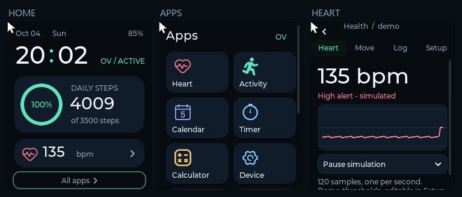

# STM32 Smartwatch

基于 STM32F411、FreeRTOS 和 LVGL 的智能手表工程，包含设备固件、硬件设计、外壳模型及 Windows 交互程序。项目基于 [OV-Watch](https://github.com/No-Chicken/OV-Watch)，扩展了健康趋势、运动目标、提醒管理、数据持久化和界面主题。



## 功能

**设备固件**

- FreeRTOS 多任务调度、消息队列、事件标志和看门狗。
- EM7028 心率采集，MPU6050 计步和抬腕唤醒。
- AHT21 温湿度、LSM303 电子罗盘、SPL06 气压与海拔。
- LCD 与触摸交互、RTC 时钟、EEPROM 参数保存和充电检测。
- 运行、STOP 休眠及关机状态管理。
- Bootloader / APP 分离，蓝牙 SPP + Ymodem 固件升级。

**健康与运动应用**

| 功能 | 实现 |
| --- | --- |
| 心率趋势 | 120 点环形缓冲，无效信号以断点表示 |
| 异常提醒 | 连续 3 次有效异常触发，持续异常不重复通知 |
| 恢复判断 | 恢复边界向内收缩 3 bpm，连续 3 次有效恢复读数关闭提醒 |
| 冷却与记录 | 30 秒冷却，保留 16 条提醒，确认状态与恢复状态独立 |
| 运动目标 | 今日步数、目标进度、每日达标通知去重 |
| 日历史 | 保留 7 条有运行记录的历史日 |
| 参数配置 | 心率阈值、步数目标、提醒开关及输入校验 |
| 数据恢复 | 版本化小端格式、CRC32、字段校验和临时文件替换 |
| 界面 | 深色卡片、心率曲线、环形运动进度和双列菜单 |

## 构建与运行

### Windows 程序

环境：Windows x64、Python 3.10+、Visual Studio 2022 C++ 桌面开发工具。构建脚本使用 CMake/Ninja，缺少 SDL2 时会下载官方固定版本并校验 SHA-256。

```powershell
python -X utf8 tools/build_pc.py --run
```

也可双击 `BUILD_WATCH.cmd` 构建并运行，后续双击 `RUN_WATCH.cmd` 启动。首次构建需要联网下载 SDL2。

- 鼠标模拟触摸；拖动可滚动页面。
- 主页心率和运动卡片进入功能页，`All apps` 打开菜单。
- `Backspace` 返回上一页，在主页按下则打开菜单。
- `Heart`、`Move`、`Log`、`Setup` 分别对应心率、运动、历史和设置。
- 心率页支持 Normal / High / Low / Invalid / Pause 输入场景。
- 设置页修改参数后，点击 `Apply and save` 保存。

运行数据保存在 `data/watch_state.bin`。参数修改立即保存，采样数据每 10 个周期保存，正常退出时再次保存。

### STM32 固件

使用 STM32CubeMX 和 Keil MDK，打开 `upstream/OV-Watch-main/Software` 下的 APP 或 IAP 工程。主控为 STM32F411CEU6，接线与器件配置以 `Hardware` 内原理图为准。固件烧录及传感器联调需要对应硬件。

## 测试

关闭程序后运行：

```powershell
python -X utf8 tools/verify_features.py --build
```

测试覆盖核心状态机、缓冲边界、异常存储文件、真实 LVGL 控件事件及进程重启恢复，共 46 项检查。生成的测试数据、截图和报告位于 `build/runs/`，不进入版本控制。可选安装 Pillow 将测试截图转换为 PNG。

## 目录

```text
src/                         健康模型、数据存储、应用调度、界面主题
tests/                       C 核心测试
tools/                       依赖下载、构建和验证脚本
simulator/                   LVGL / SDL 交互程序
docs/                        传感器与算法说明
verification/                界面截图
upstream/OV-Watch-main/
  Software/                  STM32 APP 与 Bootloader
  Hardware/                  PCB 与原理图
  3D Modle/                  外壳模型
```

## 许可证

本项目遵循 GPL-3.0。上游来源、固定版本和修改范围见 [UPSTREAM.md](UPSTREAM.md)，组件保留各自许可证和版权声明。
